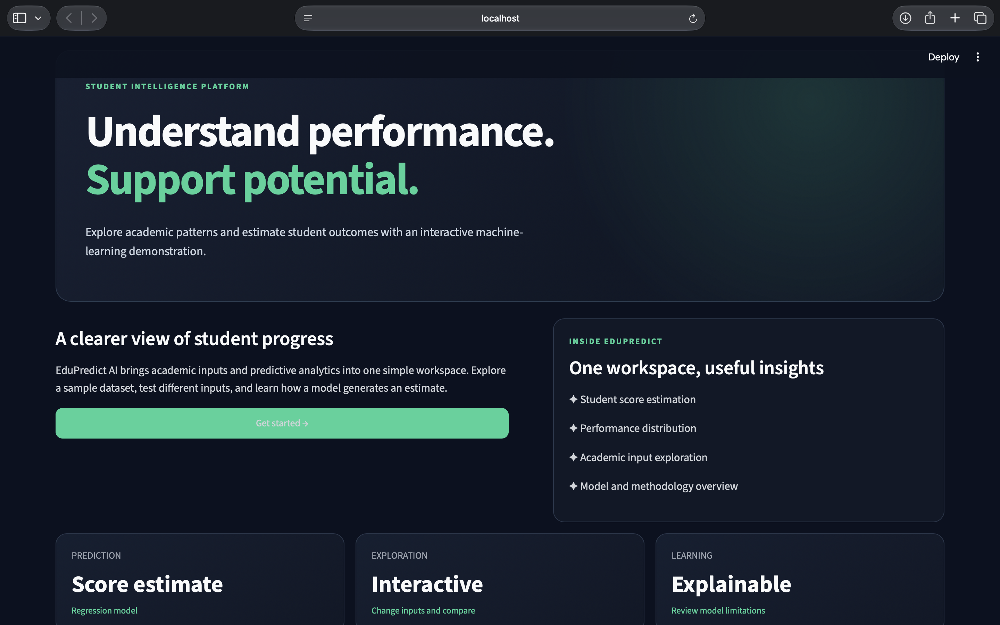
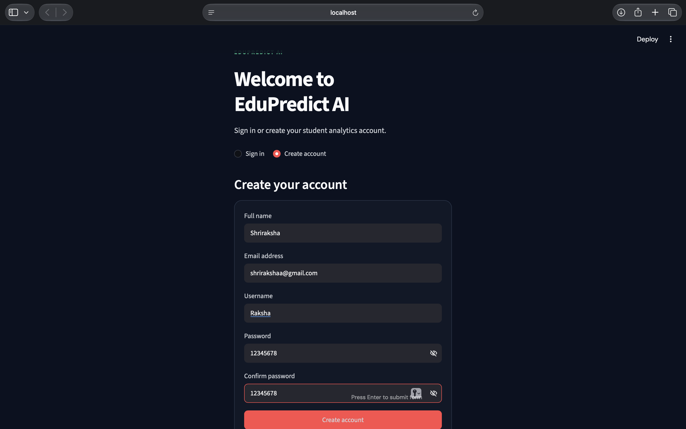
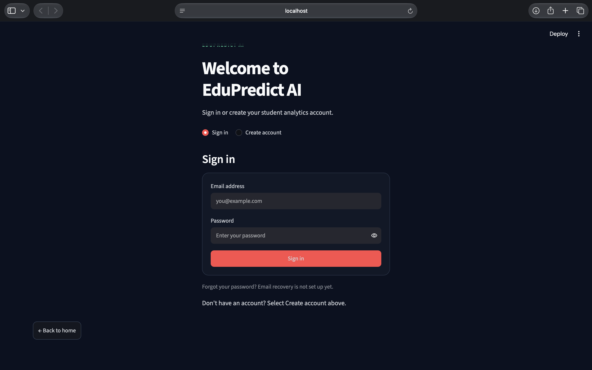
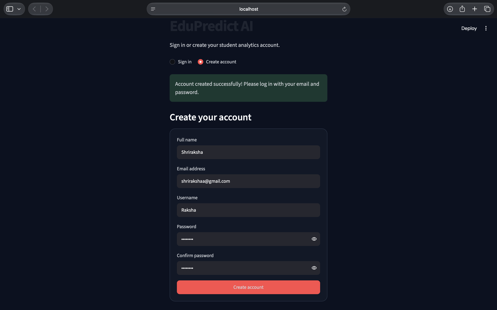
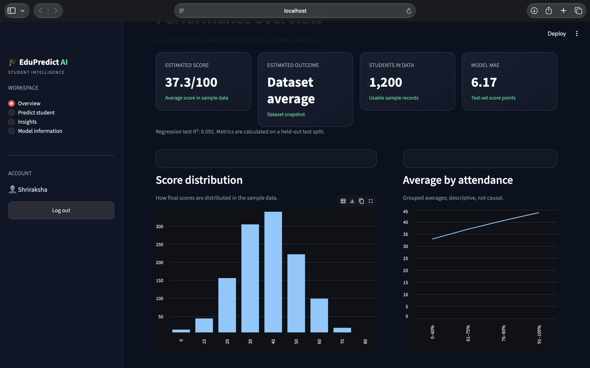
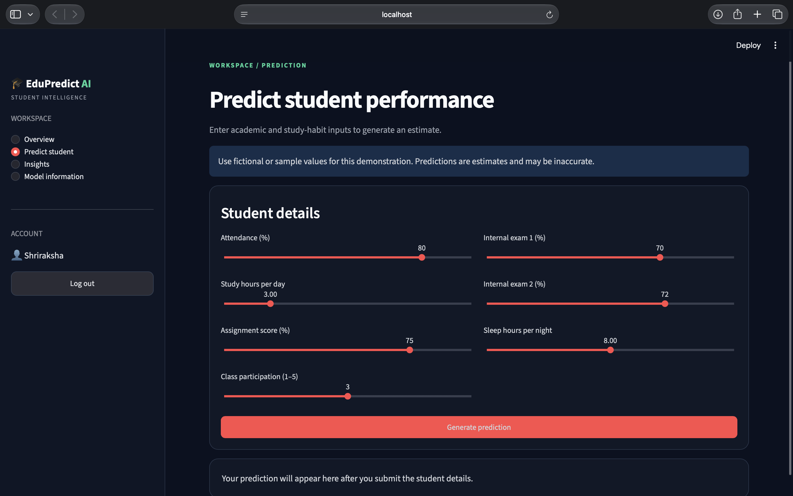
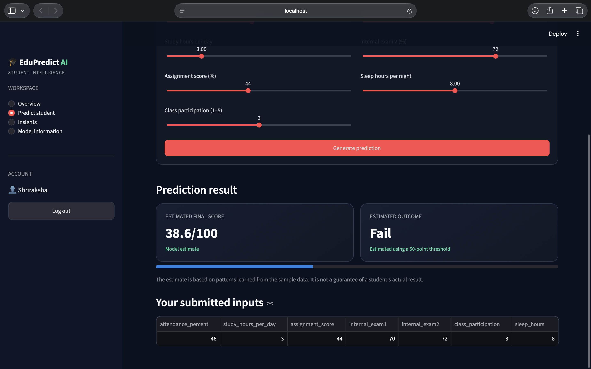
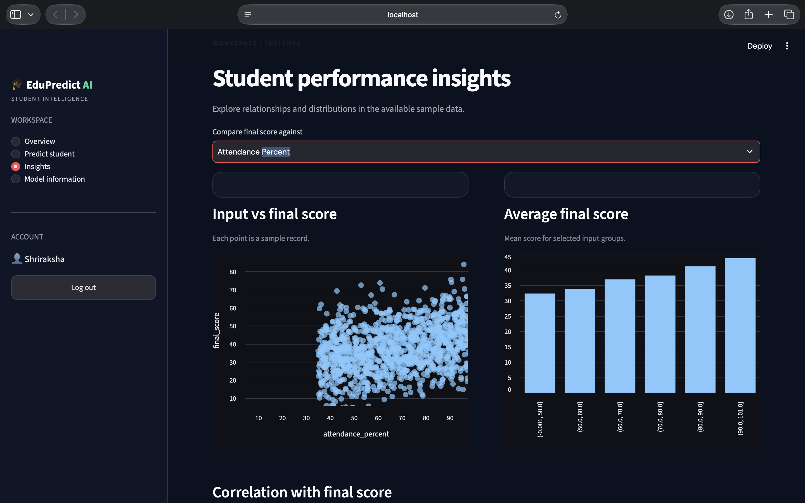
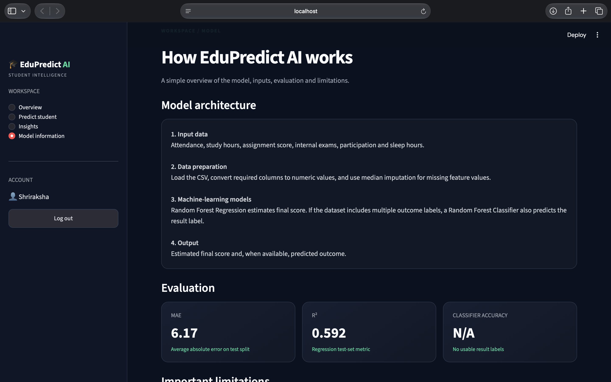

# EduPredict AI — Student Performance Prediction

An end-to-end machine-learning portfolio project that estimates a student's final score from academic and study-habit inputs.

## Features

- Synthetic-data generation for reproducible experimentation
- Data preprocessing with median imputation
- Random Forest regression pipeline
- Holdout evaluation using MAE, RMSE and R²
- Interactive Streamlit prediction interface
- User registration and login

## Important Limitation

The included dataset is synthetic, and the target is generated from a chosen formula plus noise. Results demonstrate implementation, not real-world predictive validity.

Do not use this demo to grade, label, or make decisions about real students.

## Model Evaluation

The Random Forest regression model is evaluated using a holdout test split.

| Metric | Description |
|---|---|
| MAE | Mean Absolute Error |
| RMSE | Root Mean Squared Error |
| R² | Coefficient of Determination |

Latest evaluation results:
- MAE: 6.17
- R²: 0.592

These metrics describe performance on the project's test split and synthetic dataset. They do not establish real-world predictive validity.

## Setup

Python 3.10+ recommended.

```bash
python -m venv .venv
source .venv/bin/activate
pip install -r requirements.txt
python generate_data.py
python train.py
streamlit run app.py
```

Open the local URL shown by Streamlit.

## Project Structure

```text
edupredict-ai/
├── app.py
├── auth.py
├── train.py
├── generate_data.py
├── requirements.txt
├── README.md
├── .gitignore
├── screenshots/
│   ├── homepage.png
│   ├── createaccount.png
│   ├── signup.png
│   ├── after-creating-account.png
│   ├── overview.png
│   ├── workspace.png
│   ├── result.png
│   ├── insight.png
│   └── model-info.png
├── data/
│   └── student_performance.csv
└── models/
    └── student_model.joblib
```

The dataset and trained model are generated locally and may be excluded from GitHub. The screenshots are included to demonstrate the app interface.

## Screenshots

### 1. Homepage



### 2. Create Account



### 3. Signup



### 4. Account Created



### 5. Overview Dashboard



### 6. Student Workspace



### 7. Student Prediction



### 8. Insights



### 9. Model Information



## Next Improvements

1. Compare Linear Regression, Random Forest and Gradient Boosting using the same split.
2. Add cross-validation and a residual plot.
3. Add feature importance with a clear note that importance is not causation.
4. Replace synthetic data with a suitable, ethically sourced dataset and document its license and limitations.
5. Add tests and a GitHub Actions workflow.

## GitHub

Repository: https://github.com/Shriraksha-afk/edupredict-ai

To upload updates to the existing repository:

```bash
git add app.py train.py README.md screenshots/
git commit -m "Update EduPredict AI README and screenshots"
git push origin main
```